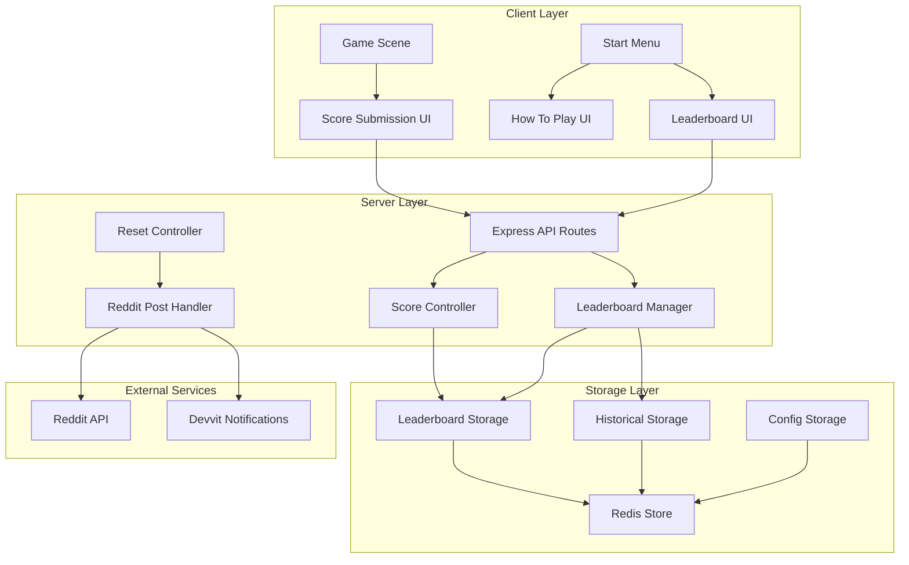

# Design Document

## Overview

The Reddit Integration System extends the existing Dicetrix game infrastructure to provide comprehensive score submission, leaderboard management, and community engagement features. The system leverages the existing Devvit platform integration, Redis storage, and Express server architecture while adding new components for automated leaderboard management, difficulty-specific tracking, and community posting.

## Architecture

### High-Level Architecture



### Component Relationships

The system builds upon the existing architecture:
- **Existing**: Game Client, Express Server, Redis Storage, Devvit Integration
- **New**: Leaderboard Manager, Reddit Post Handler, Reset Controller, Enhanced UI Components

## Components and Interfaces

### 1. Enhanced API Endpoints

#### Score Submission Enhancement
```typescript
// Enhanced existing endpoint: POST /api/game/score
interface EnhancedScoreSubmissionRequest extends ScoreSubmissionRequest {
  timestamp: number; // Client-side timestamp
  difficulty: GameMode; // Explicit difficulty tracking
}

interface EnhancedScoreSubmissionResponse extends ScoreSubmissionResponse {
  difficultyRank?: number; // Rank within difficulty category
  isNewDifficultyRecord?: boolean; // New record for this difficulty
}
```

#### New Leaderboard Endpoints
```typescript
// GET /api/leaderboards/:mode - Enhanced existing endpoint
interface EnhancedLeaderboardResponse extends LeaderboardResponse {
  resetInfo: {
    nextReset: number; // Timestamp of next reset
    resetInterval: string; // 'daily' | 'weekly' | 'monthly' | 'custom'
    currentPeriod: string; // Human-readable current period
  };
  historical?: LeaderboardEntry[]; // Previous period data
}

// GET /api/leaderboards/all - New endpoint for all difficulties
interface AllLeaderboardsResponse {
  leaderboards: Record<GameMode, EnhancedLeaderboardResponse>;
  userStats: {
    totalGamesPlayed: number;
    bestDifficulty: GameMode;
    overallRank: number;
  };
}

// POST /api/leaderboards/reset - Admin endpoint for manual reset
interface LeaderboardResetRequest {
  difficulties?: GameMode[]; // Specific difficulties to reset
  createPost?: boolean; // Whether to create announcement post
}
```

#### Reddit Integration Endpoints
```typescript
// POST /api/reddit/submit-score - Enhanced score submission with Reddit posting
interface RedditScoreSubmissionRequest {
  score: number;
  level: number;
  mode: GameMode;
  breakdown: ScoreBreakdown;
  timestamp: number;
  createPost: boolean; // User choice to post to Reddit
}

interface RedditScoreSubmissionResponse {
  success: boolean;
  leaderboardPosition?: number;
  redditPostUrl?: string;
  message: string;
}

// GET /api/reddit/leaderboard-widget - Subreddit widget data
interface LeaderboardWidgetResponse {
  topPlayers: Record<GameMode, LeaderboardEntry[]>;
  lastUpdated: number;
  nextReset: number;
}
```

### 2. Leaderboard Manager

```typescript
class LeaderboardManager {
  private redis: RedisClient;
  private config: LeaderboardConfig;
  
  // Core leaderboard operations
  async submitScore(submission: ScoreSubmission): Promise<LeaderboardResult>;
  async getLeaderboard(mode: GameMode, options?: LeaderboardOptions): Promise<LeaderboardData>;
  async getUserRank(userId: string, mode: GameMode): Promise<number | null>;
  
  // Reset management
  async scheduleReset(interval: ResetInterval): Promise<void>;
  async executeReset(modes?: GameMode[]): Promise<ResetResult>;
  async getResetSchedule(): Promise<ResetSchedule>;
  
  // Historical data
  async archiveCurrentLeaderboard(mode: GameMode): Promise<void>;
  async getHistoricalLeaderboard(mode: GameMode, period: string): Promise<LeaderboardData>;
  
  // Configuration
  async updateConfig(config: Partial<LeaderboardConfig>): Promise<void>;
  async getConfig(): Promise<LeaderboardConfig>;
}

interface LeaderboardConfig {
  resetInterval: 'daily' | 'weekly' | 'monthly' | 'custom';
  customResetHours?: number; // For custom intervals
  maxHistoricalPeriods: number;
  topPlayersCount: number;
  enableAutoPosting: boolean;
  enableNotifications: boolean;
}
```

### 3. Reddit Post Handler

```typescript
class RedditPostHandler {
  private reddit: RedditAPI;
  private context: DevvitContext;
  
  // Score submission posts
  async createScorePost(submission: ScoreSubmission): Promise<RedditPost>;
  async parseScorePost(postContent: string): Promise<ScoreSubmission | null>;
  
  // Leaderboard announcement posts
  async createLeaderboardPost(results: LeaderboardResetResult): Promise<RedditPost>;
  async formatLeaderboardContent(results: LeaderboardResetResult): Promise<string>;
  
  // User notifications
  async notifyTopPlayers(players: LeaderboardEntry[]): Promise<NotificationResult[]>;
  async sendAchievementNotification(user: string, achievement: Achievement): Promise<void>;
  
  // Subreddit widget
  async updateSubredditWidget(data: LeaderboardWidgetData): Promise<void>;
  async getWidgetContent(): Promise<string>;
}

interface RedditPost {
  id: string;
  url: string;
  title: string;
  content: string;
  timestamp: number;
}
```

### 4. Reset Controller

```typescript
class ResetController {
  private leaderboardManager: LeaderboardManager;
  private redditHandler: RedditPostHandler;
  private scheduler: TaskScheduler;
  
  // Automated reset management
  async initializeScheduler(): Promise<void>;
  async executeScheduledReset(): Promise<void>;
  async handleResetCompletion(results: ResetResult): Promise<void>;
  
  // Manual reset operations
  async triggerManualReset(options: ManualResetOptions): Promise<ResetResult>;
  async previewResetResults(): Promise<ResetPreview>;
  
  // Configuration management
  async updateResetSchedule(config: ResetConfig): Promise<void>;
  async getNextResetTime(): Promise<number>;
}
```

### 5. Enhanced Client Components

#### Score Submission UI Enhancement
```typescript
class ScoreSubmissionUI extends Phaser.GameObjects.Container {
  private scoreDisplay: Phaser.GameObjects.Text;
  private difficultyDisplay: Phaser.GameObjects.Text;
  private timestampDisplay: Phaser.GameObjects.Text;
  private submitButton: Phaser.GameObjects.Rectangle;
  private shareToRedditCheckbox: Phaser.GameObjects.Container;
  
  create(scoreData: GameEndData): void;
  handleSubmission(): Promise<void>;
  showSubmissionResult(result: SubmissionResult): void;
}
```

#### Leaderboard Scene
```typescript
class LeaderboardScene extends Phaser.Scene {
  private difficultyTabs: DifficultyTab[];
  private leaderboardDisplay: LeaderboardDisplay;
  private userStatsPanel: UserStatsPanel;
  private refreshButton: Phaser.GameObjects.Rectangle;
  
  create(): void;
  loadLeaderboardData(mode?: GameMode): Promise<void>;
  switchDifficulty(mode: GameMode): void;
  refreshData(): Promise<void>;
}
```

#### How To Play Scene
```typescript
class HowToPlayScene extends Phaser.Scene {
  private contentPages: ContentPage[];
  private navigationControls: NavigationControls;
  private backButton: Phaser.GameObjects.Rectangle;
  
  create(): void;
  loadInstructions(): void;
  navigateToPage(pageIndex: number): void;
  returnToMenu(): void;
}
```

#### Enhanced Start Menu
```typescript
// Extensions to existing StartMenu class
class StartMenu extends Scene {
  // New buttons
  private leaderboardButton: Phaser.GameObjects.Rectangle;
  private howToPlayButton: Phaser.GameObjects.Rectangle;
  
  // Enhanced layout calculation
  private calculateEnhancedButtonLayout(): MenuLayout;
  private createLeaderboardButton(): void;
  private createHowToPlayButton(): void;
  
  // Navigation handlers
  private openLeaderboard(): void;
  private openHowToPlay(): void;
}
```

## Data Models

### Enhanced Score Submission
```typescript
interface ScoreSubmission {
  userId: string;
  username: string;
  score: number;
  level: number;
  mode: GameMode;
  breakdown: ScoreBreakdown;
  timestamp: number; // When score was achieved
  submissionTime: number; // When submitted to server
  postId: string; // Reddit post context
  subredditName: string;
}
```

### Leaderboard Entry Enhancement
```typescript
interface EnhancedLeaderboardEntry extends LeaderboardEntry {
  rank: number; // Position in leaderboard
  isCurrentUser?: boolean; // Highlight user's entry
  achievementDate: number; // When score was achieved
  submissionDate: number; // When submitted
  timeSinceAchievement: string; // Human-readable time
}
```

### Reset Result Data
```typescript
interface ResetResult {
  resetId: string;
  timestamp: number;
  period: string; // e.g., "2024-10-20 to 2024-10-27"
  difficulties: GameMode[];
  topPlayers: Record<GameMode, LeaderboardEntry[]>;
  totalPlayersAffected: number;
  redditPostCreated: boolean;
  notificationsSent: NotificationResult[];
}
```

### Configuration Models
```typescript
interface SystemConfig {
  leaderboard: LeaderboardConfig;
  reddit: RedditConfig;
  notifications: NotificationConfig;
  ui: UIConfig;
}

interface RedditConfig {
  enableAutoPosting: boolean;
  enableUserNotifications: boolean;
  postTemplate: string;
  widgetUpdateInterval: number;
}

interface NotificationConfig {
  enableTopPlayerNotifications: boolean;
  notificationThreshold: number; // Top N players to notify
  achievementNotifications: boolean;
}
```

## Error Handling

### Client-Side Error Handling
```typescript
class ErrorHandler {
  // Network errors
  handleNetworkError(error: NetworkError): void;
  showRetryDialog(operation: string): void;
  
  // Validation errors
  handleValidationError(error: ValidationError): void;
  showValidationMessage(field: string, message: string): void;
  
  // Reddit integration errors
  handleRedditError(error: RedditError): void;
  showRedditUnavailableMessage(): void;
}
```

### Server-Side Error Handling
```typescript
class ServerErrorHandler {
  // Redis connection errors
  handleRedisError(error: RedisError): ErrorResponse;
  
  // Reddit API errors
  handleRedditAPIError(error: RedditAPIError): ErrorResponse;
  
  // Validation errors
  handleValidationError(error: ValidationError): ErrorResponse;
  
  // Rate limiting
  handleRateLimit(request: Request): ErrorResponse;
}
```

## Testing Strategy

### Unit Tests
- **Leaderboard Manager**: Score submission, ranking calculation, reset logic
- **Reddit Post Handler**: Post formatting, content parsing, notification sending
- **Reset Controller**: Scheduling, execution, configuration management
- **Client Components**: UI interactions, data display, navigation

### Integration Tests
- **API Endpoints**: Request/response validation, error handling
- **Redis Operations**: Data persistence, retrieval, cleanup
- **Reddit Integration**: Post creation, user notifications, widget updates
- **Cross-Component**: End-to-end score submission and leaderboard updates

### End-to-End Tests
- **Complete Score Flow**: Game end → submission → leaderboard update → Reddit post
- **Reset Process**: Scheduled reset → archival → new period → announcements
- **User Journey**: Menu navigation → leaderboard viewing → score submission
- **Mobile Responsiveness**: Touch interactions, layout adaptation

### Performance Tests
- **Leaderboard Queries**: Large dataset handling, pagination
- **Redis Operations**: Concurrent access, memory usage
- **Reddit API**: Rate limiting, timeout handling
- **Client Rendering**: Large leaderboard display, smooth animations

## Implementation Phases

### Phase 1: Core Infrastructure
1. Enhanced API endpoints for score submission with timestamps
2. Leaderboard Manager implementation
3. Redis schema updates for difficulty-specific storage
4. Basic reset scheduling system

### Phase 2: Reddit Integration
1. Reddit Post Handler implementation
2. Score submission post creation and parsing
3. User notification system
4. Subreddit widget development

### Phase 3: Client Enhancements
1. Enhanced Start Menu with new buttons
2. Leaderboard Scene implementation
3. How To Play Scene creation
4. Score Submission UI enhancements

### Phase 4: Automation & Polish
1. Automated reset system with posting
2. Historical data management
3. Configuration management interface
4. Performance optimizations and error handling

This design provides a comprehensive foundation for implementing the Reddit integration system while building upon the existing Dicetrix architecture and maintaining compatibility with current functionality.
