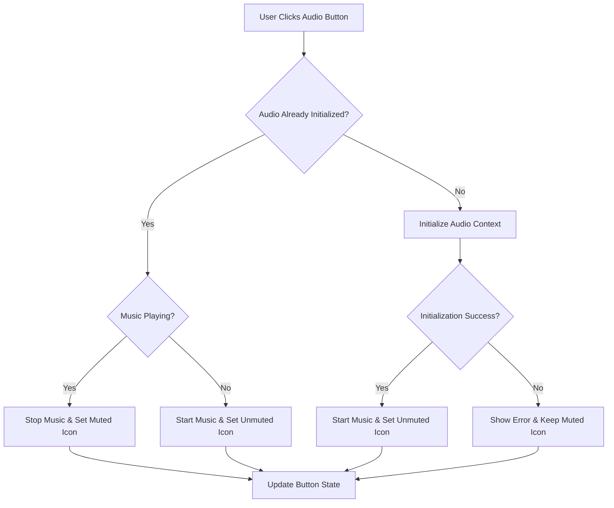

# Start Menu Audio Button Design

## Overview

This design implements a new audio control button in the Start Menu that allows users to activate audio context and toggle music playback directly from the menu. The solution repositions the existing Settings button to align with the Difficulty dropdown and adds a square audio button with speaker icon states.

## Architecture

### Component Structure

The implementation extends the existing StartMenu scene with:
- **Layout Manager**: Handles positioning calculations for button alignment
- **Audio Button Component**: Manages the new audio control button
- **Icon State Manager**: Handles muted/unmuted speaker icon transitions
- **Audio Integration Layer**: Connects button actions to existing audio systems

### Integration Points

- **Existing Audio System**: Leverages `enableAudioOnUserInteraction()` and `audioHandler` service
- **UI Scaling System**: Integrates with existing `UI_SCALE` factor (2x)
- **Settings Button**: Repositions existing button without changing functionality
- **Difficulty Dropdown**: Uses as reference point for alignment calculations

## Components and Interfaces

### Layout Calculations

```typescript
interface ButtonLayout {
  settingsX: number;
  settingsY: number;
  audioButtonX: number;
  audioButtonY: number;
  buttonSpacing: number;
}

interface AudioButtonConfig {
  width: number;
  height: number;
  iconSize: number;
  backgroundColor: number;
  hoverColor: number;
}
```

### Audio Button States

```typescript
enum AudioButtonState {
  MUTED = 'muted',
  UNMUTED = 'unmuted',
  LOADING = 'loading'
}

interface AudioButtonManager {
  currentState: AudioButtonState;
  button: Phaser.GameObjects.Rectangle;
  icon: Phaser.GameObjects.Text;
  updateState(newState: AudioButtonState): void;
  handleClick(): Promise<void>;
}
```

### Icon System

The audio button uses text-based icons for simplicity and consistency:
- **Muted State**: `🔇` (U+1F507) - Muted speaker symbol
- **Unmuted State**: `🔊` (U+1F50A) - Speaker with sound waves
- **Loading State**: `⏳` (U+23F3) - Hourglass for initialization feedback

## Data Models

### Button Position Model

```typescript
interface ButtonPositioning {
  // Reference points from existing elements
  dropdownLeft: number;
  dropdownWidth: number;
  dropdownY: number;
  
  // Calculated positions
  settingsButtonLeft: number;
  settingsButtonWidth: number;
  audioButtonLeft: number;
  audioButtonSize: number;
  
  // Spacing constants
  buttonSpacing: number; // 20px * UI_SCALE
  verticalOffset: number; // Distance below dropdown
}
```

### Audio State Model

```typescript
interface AudioControlState {
  isAudioInitialized: boolean;
  isMusicPlaying: boolean;
  buttonState: AudioButtonState;
  lastInteractionTime: number;
  initializationPromise?: Promise<void>;
}
```

## Error Handling

### Audio Initialization Failures

1. **Timeout Protection**: 5-second timeout for audio context activation
2. **Graceful Degradation**: Button remains functional even if audio fails
3. **User Feedback**: Visual indication when audio initialization fails
4. **Retry Mechanism**: Allow user to retry audio activation

### Browser Compatibility

1. **AudioContext Support**: Detect and handle missing AudioContext API
2. **Autoplay Policies**: Comply with Chrome, Safari, and Firefox autoplay restrictions
3. **Mobile Considerations**: Handle iOS Safari audio context quirks
4. **Fallback Behavior**: Maintain button functionality without audio

### Error Recovery Patterns

```typescript
interface ErrorHandling {
  handleAudioInitError(error: Error): void;
  handleContextSuspended(): Promise<void>;
  handlePermissionDenied(): void;
  showUserFeedback(message: string, type: 'error' | 'warning' | 'info'): void;
}
```

## Testing Strategy

### Unit Testing Focus

1. **Button Positioning**: Verify correct alignment calculations
2. **State Management**: Test audio button state transitions
3. **Icon Updates**: Validate icon changes match audio state
4. **Error Handling**: Test graceful failure scenarios

### Integration Testing

1. **Audio System Integration**: Verify compatibility with existing audio handler
2. **UI Scaling**: Test button behavior across different UI scales
3. **Cross-Scene Compatibility**: Ensure audio state persists across scene transitions
4. **User Interaction Flow**: Test complete user journey from menu to game

### Browser Testing

1. **Autoplay Policy Compliance**: Test across Chrome, Safari, Firefox
2. **Mobile Device Testing**: Verify touch interactions and responsive behavior
3. **Audio Context Lifecycle**: Test suspend/resume scenarios
4. **Performance Impact**: Measure button rendering and audio initialization overhead

## Implementation Details

### Button Creation Sequence

1. **Calculate Positions**: Determine alignment based on dropdown position
2. **Reposition Settings**: Move existing settings button to left-aligned position
3. **Create Audio Button**: Generate square button with initial muted icon
4. **Setup Interactions**: Bind click handlers and hover effects
5. **Initialize State**: Set initial audio state and button appearance

### Audio Activation Flow



### State Synchronization

The audio button maintains synchronization with the global audio state:
- **Scene Transitions**: Preserve audio state when navigating between scenes
- **External Audio Changes**: Update button state if audio is controlled elsewhere
- **Browser Events**: Handle audio context state changes from browser policies
- **Error Recovery**: Reset button state after audio system recovery

### Performance Considerations

1. **Lazy Initialization**: Only initialize audio when button is first clicked
2. **Event Debouncing**: Prevent rapid clicking from causing multiple initializations
3. **Memory Management**: Properly dispose of audio resources when scene ends
4. **Rendering Optimization**: Use efficient icon rendering without texture loading

### Accessibility Features

1. **Keyboard Navigation**: Support tab navigation to audio button
2. **Screen Reader Support**: Provide appropriate ARIA labels for button states
3. **High Contrast**: Ensure button visibility in high contrast modes
4. **Touch Targets**: Maintain minimum 44px touch target size on mobile

## Visual Design Specifications

### Button Dimensions

- **Height**: Match Settings button height (calculated from font size + padding)
- **Width**: Equal to height (square aspect ratio)
- **Spacing**: 20px * UI_SCALE between Settings and Audio buttons
- **Alignment**: Top edges aligned, left edge of Settings aligned with dropdown

### Color Scheme

- **Default Background**: `#666666` (matching Settings button)
- **Hover Background**: `#888888` (matching Settings button hover)
- **Icon Color**: `#ffffff` (white for visibility)
- **Border**: `1px solid #000000` with 20% opacity

### Icon Styling

- **Font Size**: 18px * UI_SCALE (proportional to button size)
- **Font Family**: System emoji font for consistent rendering
- **Positioning**: Centered both horizontally and vertically
- **Transitions**: 200ms ease-in-out for state changes

### Responsive Behavior

The audio button adapts to different screen sizes while maintaining:
- **Proportional Scaling**: All dimensions scale with UI_SCALE factor
- **Relative Positioning**: Position calculated relative to dropdown and settings button
- **Minimum Size**: Ensure button remains usable on smallest supported screens
- **Maximum Size**: Cap button size on very large displays for usability
