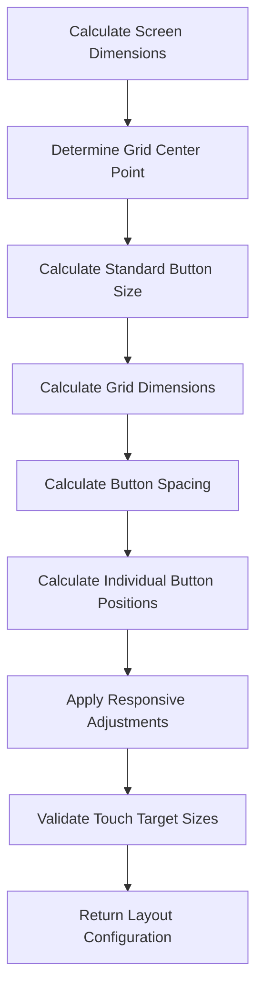
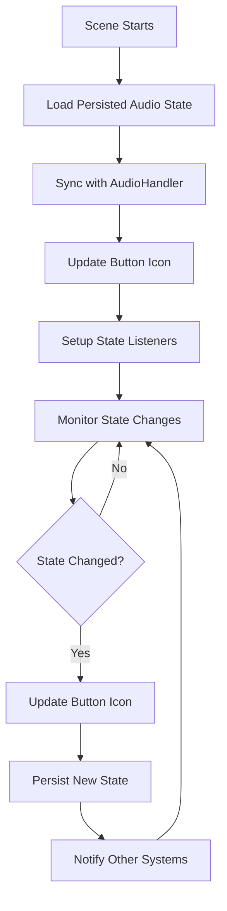

# Start Menu Layout Improvements Design

## Overview

This design addresses the layout inconsistencies and audio state synchronization issues in the Start Menu. The solution standardizes button sizing, improves grid alignment, ensures proper audio state reflection, and maintains cross-scene audio setting persistence. The implementation builds upon the existing 2x2 grid layout while fixing alignment and sizing issues.

## Architecture

### Component Structure

The implementation enhances the existing StartMenu scene with:
- **Grid Layout Manager**: Handles consistent button sizing and positioning calculations
- **Button Factory**: Creates standardized buttons with consistent styling and behavior
- **Audio State Synchronizer**: Manages audio state persistence and synchronization across scenes
- **Responsive Layout Controller**: Handles dynamic layout adjustments for different screen sizes

### Integration Points

- **Existing Audio System**: Leverages `audioHandler` service for state management and persistence
- **Settings Service**: Uses `settings` service for persistent audio preference storage
- **UI Scaling System**: Integrates with existing `UI_SCALE` factor (2x)
- **Scene Registry**: Uses Phaser's registry system for cross-scene state sharing

## Components and Interfaces

### Grid Layout System

```typescript
interface ButtonGridLayout {
  gridCenterX: number;
  gridCenterY: number;
  buttonWidth: number;
  buttonHeight: number;
  horizontalSpacing: number;
  verticalSpacing: number;
  positions: {
    topLeft: { x: number; y: number };
    topRight: { x: number; y: number };
    bottomLeft: { x: number; y: number };
    bottomRight: { x: number; y: number };
  };
}

interface ButtonDimensions {
  width: number;
  height: number;
  fontSize: number;
  paddingX: number;
  paddingY: number;
}
```

### Button Factory System

```typescript
interface StandardButton {
  button: Phaser.GameObjects.Text;
  config: ButtonConfig;
  updateState(enabled: boolean): void;
  destroy(): void;
}

interface ButtonConfig {
  text: string;
  position: { x: number; y: number };
  dimensions: ButtonDimensions;
  onClick: () => void;
  hoverColor: number;
  normalColor: number;
  pressColor: number;
}
```

### Audio State Management

```typescript
interface AudioStateManager {
  currentState: 'enabled' | 'disabled';
  isInitialized: boolean;
  syncWithGlobalState(): void;
  updateButtonIcon(): void;
  persistState(): void;
  loadPersistedState(): void;
}

interface AudioButtonState {
  icon: '🔇' | '🔊';
  isEnabled: boolean;
  isInitializing: boolean;
  lastSyncTime: number;
}
```

## Data Models

### Button Grid Configuration

```typescript
interface GridConfiguration {
  // Grid positioning
  baseY: number; // Y position relative to screen height (0.75)
  gridWidth: number; // Total width of the 2x2 grid
  gridHeight: number; // Total height of the 2x2 grid
  
  // Button standardization
  standardButtonWidth: number; // Width that accommodates longest text
  standardButtonHeight: number; // Height based on font size + padding
  
  // Spacing calculations
  horizontalSpacing: number; // Space between left and right columns
  verticalSpacing: number; // Space between top and bottom rows
  
  // Responsive behavior
  minButtonSize: number; // Minimum size for mobile devices
  maxButtonSize: number; // Maximum size for large screens
  touchTargetSize: number; // Minimum touch target (44px)
}
```

### Audio Synchronization Model

```typescript
interface AudioSyncState {
  // Current audio state
  musicEnabled: boolean;
  soundEnabled: boolean;
  globalAudioEnabled: boolean;
  
  // Persistence tracking
  lastPersistedState: string;
  lastSyncTimestamp: number;
  
  // Cross-scene synchronization
  sceneTransitionState: 'entering' | 'active' | 'leaving';
  pendingStateUpdates: AudioStateUpdate[];
}

interface AudioStateUpdate {
  property: 'music' | 'sound' | 'global';
  value: boolean;
  timestamp: number;
  source: string; // Which scene initiated the change
}
```

## Error Handling

### Layout Calculation Failures

1. **Fallback Positioning**: Use safe default positions if calculations fail
2. **Minimum Size Enforcement**: Ensure buttons never become too small to use
3. **Overflow Protection**: Handle cases where grid doesn't fit on screen
4. **Responsive Degradation**: Gracefully handle extreme screen sizes

### Audio State Synchronization Failures

1. **State Recovery**: Restore last known good audio state if sync fails
2. **Persistence Fallbacks**: Use multiple storage mechanisms for reliability
3. **Cross-Scene Consistency**: Ensure audio state remains consistent even if sync fails
4. **User Feedback**: Provide visual indication when audio state is uncertain

### Button Creation Failures

```typescript
interface ButtonErrorHandling {
  handleCreationFailure(buttonType: string, error: Error): StandardButton;
  handleInteractionFailure(buttonType: string, error: Error): void;
  handleStyleUpdateFailure(button: StandardButton, error: Error): void;
  provideFallbackButton(buttonType: string): StandardButton;
}
```

## Testing Strategy

### Layout Testing Focus

1. **Grid Alignment**: Verify perfect 2x2 grid positioning across screen sizes
2. **Button Consistency**: Test that all buttons have identical dimensions
3. **Responsive Behavior**: Validate layout adaptation to different screen sizes
4. **Touch Target Compliance**: Ensure minimum 44px touch targets on mobile

### Audio State Testing

1. **Cross-Scene Persistence**: Test audio settings persist between scene transitions
2. **State Synchronization**: Verify audio button reflects actual audio state
3. **Browser Compatibility**: Test audio state management across different browsers
4. **Error Recovery**: Test graceful handling of audio system failures

### Integration Testing

1. **Existing System Compatibility**: Ensure changes don't break existing functionality
2. **Performance Impact**: Measure layout calculation and rendering performance
3. **Memory Management**: Verify proper cleanup of event listeners and objects
4. **User Experience Flow**: Test complete user interaction flows

## Implementation Details

### Button Standardization Process

1. **Text Measurement**: Calculate required width for longest button text
2. **Dimension Standardization**: Apply consistent width/height to all buttons
3. **Font Size Normalization**: Use consistent font size across all buttons
4. **Padding Standardization**: Apply uniform padding for visual consistency
5. **Style Unification**: Ensure consistent colors, borders, and effects

### Grid Layout Calculation



### Audio State Synchronization Flow



### Responsive Layout Adaptation

The layout system adapts to different screen sizes while maintaining usability:

1. **Mobile Optimization**: Ensure touch targets meet accessibility guidelines
2. **Desktop Enhancement**: Provide hover effects and precise positioning
3. **Tablet Adaptation**: Balance between mobile and desktop approaches
4. **Extreme Size Handling**: Gracefully handle very small or very large screens

### Performance Considerations

1. **Layout Caching**: Cache layout calculations to avoid repeated computation
2. **Event Debouncing**: Debounce resize events to prevent excessive recalculation
3. **Selective Updates**: Only update elements that actually changed
4. **Memory Efficiency**: Properly dispose of unused objects and listeners

## Visual Design Specifications

### Button Standardization

- **Width**: Calculated from longest text ("LEADERBOARD") + padding
- **Height**: Based on font size (24px * UI_SCALE) + vertical padding
- **Font Size**: 24px * UI_SCALE (consistent across all buttons)
- **Padding**: 25px * UI_SCALE horizontal, 12px * UI_SCALE vertical
- **Border**: 1px solid black with 20% opacity

### Grid Layout Specifications

- **Grid Position**: Centered horizontally, positioned at 75% of screen height
- **Horizontal Spacing**: 20px * UI_SCALE between columns
- **Vertical Spacing**: 20px * UI_SCALE between rows
- **Grid Alignment**: Perfect center alignment with equal spacing
- **Touch Targets**: Minimum 44px for mobile accessibility

### Color Scheme Consistency

- **Normal State**: `#666666` background, `#ffffff` text
- **Hover State**: `#888888` background, `#ffffff` text
- **Press State**: `#444444` background, `#ffffff` text
- **Disabled State**: `#444444` background, `#888888` text
- **Audio Button Icons**: `#ffffff` color for visibility

### Audio Button Icon States

- **Muted State**: 🔇 (U+1F507) - Displayed when audio is disabled
- **Unmuted State**: 🔊 (U+1F50A) - Displayed when audio is enabled
- **Loading State**: ⏳ (U+23F3) - Displayed during audio initialization
- **Error State**: ❌ (U+274C) - Displayed when audio system fails

### Responsive Behavior Specifications

The layout maintains consistency across different screen sizes:

- **Mobile (≤768px)**: Optimized spacing and touch targets
- **Tablet (769px-1024px)**: Balanced layout with moderate spacing
- **Desktop (>1024px)**: Full spacing and hover effects
- **Minimum Size**: Buttons never smaller than 44px touch target
- **Maximum Size**: Buttons capped at reasonable size for large screens

## Accessibility Considerations

1. **Touch Targets**: Minimum 44px touch targets for mobile accessibility
2. **Color Contrast**: Ensure sufficient contrast between text and background
3. **Keyboard Navigation**: Support tab navigation between buttons
4. **Screen Reader Support**: Provide appropriate ARIA labels
5. **High Contrast Mode**: Ensure visibility in high contrast display modes

## Cross-Scene Integration

### Audio State Persistence

The audio state synchronization ensures consistency across all game scenes:

1. **Scene Entry**: Load current audio state from persistent storage
2. **State Changes**: Immediately persist changes and notify other systems
3. **Scene Exit**: Ensure current state is saved before transition
4. **Error Recovery**: Restore last known good state if corruption occurs

### Registry Integration

Uses Phaser's registry system for real-time state sharing:

```typescript
// Setting audio state
this.registry.set('audioEnabled', true);
this.registry.set('musicEnabled', true);
this.registry.set('soundEnabled', true);

// Listening for changes
this.registry.events.on('changedata-audioEnabled', (parent, key, data) => {
  this.updateAudioButtonState(data);
});
```

### Settings Service Integration

Integrates with the existing settings service for long-term persistence:

```typescript
// Save settings
settings.set('audioEnabled', audioEnabled);
settings.set('musicEnabled', musicEnabled);
settings.set('soundEnabled', soundEnabled);

// Load settings
const audioEnabled = settings.get('audioEnabled') ?? true;
const musicEnabled = settings.get('musicEnabled') ?? true;
const soundEnabled = settings.get('soundEnabled') ?? true;
```
